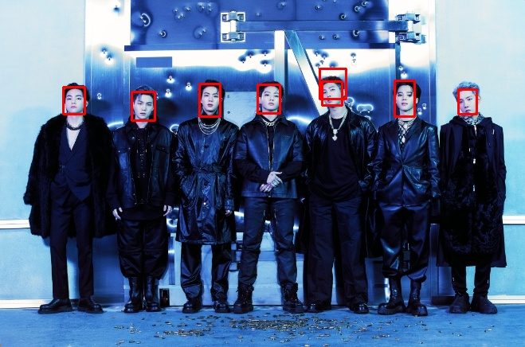

# Face-Vision

Face-Vision is a Python-based tool for detecting faces in images and videos using OpenCV and a pre-trained deep learning model. This project provides an easy way to apply face detection algorithms to various types of media files.

## Features

- **Face Detection**: Detects faces in images and video files with adjustable confidence thresholds.
- **Supported Formats**: Handles common image formats (`.jpg`, `.jpeg`, `.png`) and video formats (`.mp4`, `.avi`, `.mov`).
- **Simple GUI**: Uses Tkinter to provide an easy file selection interface.
- **Customizable**: Adjust the detection confidence thresholds and model parameters to fit different use cases.

## Requirements

- Python 3.x
- OpenCV (`cv2`): Install using `pip install opencv-python`
- Tkinter: Usually included with Python installations
- Numpy: Install using `pip install numpy`

## Installation

1. Clone the repository:
    ```bash
    git clone https://github.com/yourusername/Face-Vision.git
    ```

2. Navigate to the project directory:
    ```bash
    cd Face-Vision
    ```

3. Install the required Python packages:
    ```bash
    pip install opencv-python numpy
    ```

4. Download the pre-trained face detection model files:
    - [deploy.prototxt](https://github.com/opencv/opencv/blob/master/samples/dnn/face_detector/deploy.prototxt)
    - [res10_300x300_ssd_iter_140000_fp16.caffemodel](https://github.com/opencv/opencv/blob/master/samples/dnn/face_detector/res10_300x300_ssd_iter_140000_fp16.caffemodel)

   Place these files in the project directory.

## Usage

1. Run the script:
    ```bash
    python face_detection.py
    ```

2. A file dialog will appear. Choose an image or video file to process.

3. The script will detect faces and display/save the results:
   - For images: Output will be saved as `detected_faces.jpg` and displayed in a window.
   - For videos: Output will be saved as `detected_faces_video.avi` and displayed in a window.

## Examples

### Image Example

To illustrate how Face-Vision works, here's an example of face detection on an image:

**Original Image:**


**Detected Faces:**



In the "Detected Faces" image, rectangles are drawn around the detected faces.

### Video Example

Here's an example of face detection on a video:

**Original Video Sample:**


**Processed Video Sample:**


*Note: The video file was compressed using [freeconvert.com](https://www.freeconvert.com) for easier upload on GitHub.*

## Code Overview

- **`face_detection.py`**: Main script that handles file selection, model loading, face detection, and result display.
- **`choose_file()`**: Opens a file dialog to select images or videos.
- **`load_face_detection_model()`**: Loads the pre-trained face detection model.
- **`detect_faces()`**: Applies face detection to an image.
- **`draw_faces_on_image()`**: Draws rectangles around detected faces.
- **`process_image()`**: Handles face detection and display for images.
- **`process_video()`**: Handles face detection and processing for videos.

## License

This project is licensed under the Boost Software License 1.0. See the [LICENSE](LICENSE) file for details.

## Acknowledgements

- **OpenCV**: For providing the tools and libraries used for face detection.
- **BTS and HYBE Labels**: For the image and video samples used in this project.
- **freeconvert.com**: For compressing the video files for GitHub upload.

